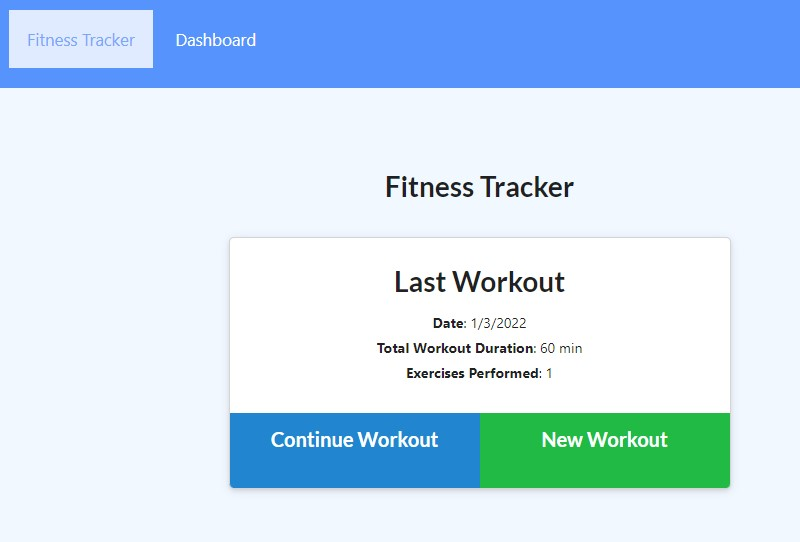
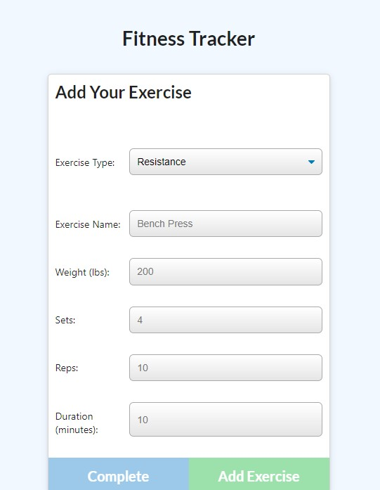
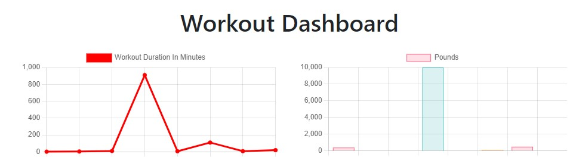

# Workout Tracker

## Overview

This app will allow users to track their workout stats by adding individual exercises and metrics to a database. The user can also view their total duration of their exercises and weight lifted for the last week using the dashboard page.

[Deployed Version](https://sosebee-workout-tracker.herokuapp.com)

[GitHub Repo](https://github.com/steven-sosebee/workout-tracker)

## Using the App

Users are presented with a dashboard screen where they can add to their prior workouts or create a new one.

Either option will take the user to a second screen to add the exercise details.

when the user has generated multiple workouts and would like to review the metrics for the past week, the user can navigate to the dashboard page and view the charts detailing how long the user has worked out and how much total weight was lifted.

## Technology Used

The app uses Node.js to run the server. The back-end is hosted on MongoAtlas and uses a NoSQL collection.

## Contact

For collaboration or questions, please reach out to:

swsosebee@gmail.com

https://github.com/steven-sosebee
